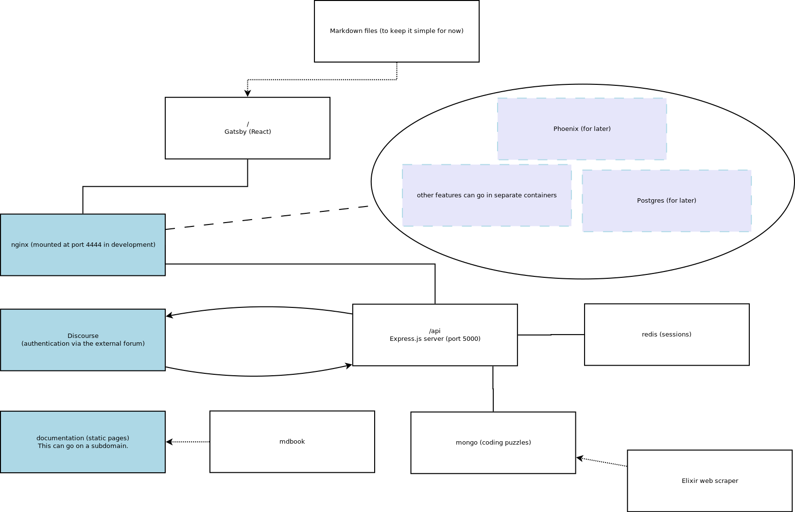

# Docker

Technolgies:

- **Nginx** -- requests get passed through an nginx container
- **Gatsby** -- server-rendered React with content loaded from a headless CMS
- **Express API** -- this authenticates with Discourse (forum) and serves coding puzzles
- **Redis** -- session store for the Express API
- **Mongo** -- data storage for coding puzzles
- **Phoenix/Postgres** -- coming later once the site is ready for real-time features and the data gets more complex

Check out the `containers` directory. Each directory there is a separate Docker container.

Here's a diagram. See the other pages in this section for details.

